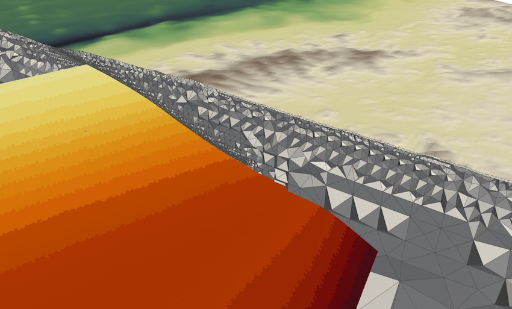

# Training 

Welcome to dynamic rupture simulation training. 
Please clone this repository with git (using the command line) or download it directly from the browser.

This repository contains a Dockerfile to build a Docker container.
The Docker container contains an interactive learning environment (Jupyter) which includes meshing tools, SeisSol, and visualiation tools.

More dynamic rupture simulation examples and details [SeisSol/Training](https://github.com/SeisSol/Training) 



## Installation

Please install [Docker](https://docs.docker.com/engine/install/), launch the Docker Desktop and then run

if on MacOS M1/M2/M3/M4 CPU, try:
```bash
docker pull daisy20170101/seissol-training1:latest
```
or on Win/Linux or all Intel/AMD machines, try:

```bash
docker pull daisy20170101/seissol-training1:ubuntu-22-05
```

## Training

After installation, run
```bash
docker run -p 53155:53155 daisy20170101/seissol-training1:latest
```
or run the [start_gns24.sh](start_gns24.sh) script.

After some time you should see
```bash
http://127.0.0.1:53155/lab?token=some5cryptic8hash123
```
Click on that link or enter the link in the address bar of your favourite web browser.

Then use the navigation bar to open the exercises (e.g., [training1.ipynb](training1.ipynb)).

## Tools

You can also use the tools in the Docker container for creating input files or running SeisSol on your local computer.
To this end, you need to mount your local drive within the Docker container with the following command:
```bash
docker run -v $(pwd):/shared/ -u $(id -u):$(id -g) daisy20170101/seissol-training1  <some command>
```
As this command is rather long, we provide the wrapper script [tool_gns24.sh](tool_gns24.sh).

The following tools are currently included:
- PUMGen (mesh generation for SeisSol, https://github.com/SeisSol/PUMGen, see also SeisSol's documentation https://seissol.readthedocs.io/en/latest/meshing-with-pumgen.html)
- GMSH (open source 3D finite element mesh generator, client only, https://gmsh.info)
- rconv (tool to describe point and finite source models in SeisSol's NetCDF Rupture Format, https://seissol.readthedocs.io/en/latest/standard-rupture-format.html#how-to-use-rconv)
- SeisSol O4 (pre-compiled SeisSol with 4th order space-time accuracy for elastic and viscoelastic materials, https://seissol.readthedocs.io). We use the SeisSol `v1.0.1`. See the first lines of the SeisSol output to get the exact commit hash.


I.e.
```
./tool_gns24.sh pumgen <args>
./tool_gns24.sh gmsh <args>
./tool_gns24.sh rconv <args>
./tool_gns24.sh seissol <args>
```
